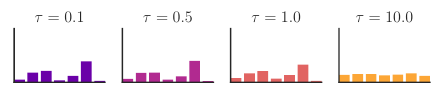
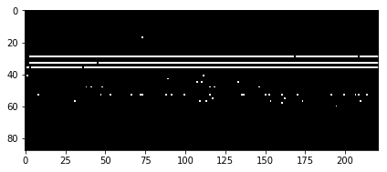

## Learning to generate lyrics and music with Recurrent Neural Networks

In this post we will train RNN character-level language model on lyrics dataset of
most popular/recent artists. Having a trained model, we will sample a couple of
songs which will be a funny mixture of different styles of different artists.
After that we will update our model to become a conditional character-level RNN,
making it possible for us to sample songs conditioned on artist.
And finally, we conclude by training our model on midi dataset of piano songs.
While solving all these tasks, we will briefly explore some interesting concepts related to RNN
training and inference like character-level RNN, conditional character-level RNN,
sampling from RNN, truncated backpropagation through time and gradient checkpointing.


### Character-Level language model


Before choosing a model, let's have a closer look at our task. Given current letter and all previous
letters, we will try to predict the next character. During training we will just take a sequence, and use
all its characters except the last one as an input and the same sequence starting from the second character as groundtruth (see the picture above; [Source](https://github.com/spro/practical-pytorch/blob/master/conditional-char-rnn/conditional-char-rnn.ipynb)). We will start from the simplest model that ignores all the previous characters while making a prediction, improve this model to make it take only a certain number of previous characters into account, and conclude with a model that takes all the previous characters into consideration while making a prediction.

Our language model is defined on a character level. We will create a dictionary which will contain
all English characters plus some special symbols, like period, comma, and end-of-line symbol. Each charecter will be represented as one-hot-encoded tensor. For more information about character-level models and examples, I recommend [this resource](https://github.com/spro/practical-pytorch).

Having characters, we can now form sequences of characters. We can generate sentences even now just by
randomly sampling character after character with a fixed probability $p(any~letter)=\frac{1}{dictionary~size}$.
That's the most simple character level language model. Can we do better than this? Yes, we can compute the probabily of occurance of each letter from our training corpus (number of times a letter occures divided by the size of our dataset) and randomly sample letter using these probabilities. This model is better but it totally ignores the relative positional aspect of each letter. For example, pay attention on how you read any word: you start with the first letter, which is usually hard to predict, but as you reach the end of a word you can sometimes guess the next letter. When you read any word you are implicitly using some rules which you learned by reading other texts: for example, with each additional letter that you read from a word, the probability of a space character increases (really long words are rare) or the probability of any consonant after the letter "r" is low as it usually followed by vowel. There are lot of similar rules and we hope that our model will be able to learn them from data. To give our model a chance to learn these rules we need to extend it.

Let's make a small gradual improvement of our model and let probability of each letter depend
only on the previously occured letter ([markov assumption](https://en.wikipedia.org/wiki/Markov_property)). So, basically we will have $p(current~letter|previous~letter)$.
This is a [Markov chain model](https://en.wikipedia.org/wiki/Markov_chain) (also try these [interactive visualizations](http://setosa.io/ev/markov-chains/) if you are not familiar with it). We can also estimate the probability distribution $p(current~letter|previous~letter)$ from our training dataset. This model is limited because in most cases the probability of the current letter depends not only on the previous letter.

What we would like to model is actually $p(current~letter|all~previous~letters)$. At first, the task seems intractable as the number of previous letters is variable and it might become really large in case of long
sequences. Turns out Reccurent Neural Netoworks can tackle this problem to a certain extent by using shared weights and fixed size hidden state. This leads us to a next section dedicated to RNNs.

### Recurrent Neural Networks


Recurrent neural networks are a family of neural networks for processing sequential data.
Unlike feedforward neural networks, RNNs can use their internal memory to process arbitrary sequences of inputs.
Because of arbitrary size input sequences, they are concisely depicted as a graph with a cycle (see the picture; [Source](http://www.wildml.com/2015/09/recurrent-neural-networks-tutorial-part-1-introduction-to-rnns/)).
But they can be "unfolded" if the size of input sequence is known. They define a non-linear mapping from a current input $x_t$ and previous hidden state $s_{t-1}$ to the output $o_t$ and current hidden state $s_t$. Hidden state size has a predefined size and stores features which are updated on each step and affect the result of mapping.

Now align the previous picture of the character-level language model and the ufolded RNN picture to see how
we are using the RNN model to learn a character level language model.

While the picture depicts the Vanilla RNN, we will use LSTM in our work as it is easier to train usually achieves better results.

For a more elaborate introduction to RNNs, we refer reader to the [following resource](http://www.wildml.com/2015/09/recurrent-neural-networks-tutorial-part-1-introduction-to-rnns/).

### Lyrics dataset

For our experiments we have chosen [55000+ Song Lyrics Kaggle dataset](https://www.kaggle.com/mousehead/songlyrics) which contains good variety of recent artists and more older ones. It is stored as a pandas file and we wrote a python wrapper around it to be able to use it for training purposes. You will have to download it yourself in order to be able to use our code.

In order to be able to interpret the results better, I have chosen a subset of artists which I am
more or less familiar with:


```python
artists = [
'ABBA',
'Ace Of Base',
'Aerosmith',
'Avril Lavigne',
'Backstreet Boys',
'Bob Marley',
'Bon Jovi',
'Britney Spears',
'Bruno Mars',
'Coldplay',
'Def Leppard',
'Depeche Mode',
'Ed Sheeran',
'Elton John',
'Elvis Presley',
'Eminem',
'Enrique Iglesias',
'Evanescence',
'Fall Out Boy',
'Foo Fighters',
'Green Day',
 'HIM',
 'Imagine Dragons',
 'Incubus',
 'Jimi Hendrix',
 'Justin Bieber',
 'Justin Timberlake',
'Kanye West',
 'Katy Perry',
 'The Killers',
 'Kiss',
 'Lady Gaga',
 'Lana Del Rey',
 'Linkin Park',
 'Madonna',
 'Marilyn Manson',
 'Maroon 5',
 'Metallica',
 'Michael Bolton',
 'Michael Jackson',
 'Miley Cyrus',
 'Nickelback',
 'Nightwish',
 'Nirvana',
 'Oasis',
 'Offspring',
 'One Direction',
 'Ozzy Osbourne',
 'P!nk',
 'Queen',
 'Radiohead',
 'Red Hot Chili Peppers',
 'Rihanna',
 'Robbie Williams',
 'Rolling Stones',
 'Roxette',
 'Scorpions',
 'Snoop Dogg',
 'Sting',
 'The Script',
 'U2',
 'Weezer',
 'Yellowcard',
 'ZZ Top']
```

### Training unconditional character-level language model

Our first experiment consisted of training of our character-level language model RNN
on the whole corpus. We didn't take into consideration the artist information while training.

### Sampling from RNN

Let's try to sample a couple of songs after training our model. Basically, on each
step our RNN will output logits and we can softmax them and sample from that distribution.
Or we can use Gumble-Max trick and [sample using logits directly](https://hips.seas.harvard.edu/blog/2013/04/06/the-gumbel-max-trick-for-discrete-distributions/) which is equivalent.

One intersting thing about sampling is that we can partially define the input sequence ourselves and start sampling
with that initial condition. For example, we can sample a song that starts with "Why":

```
Why do you have to leave me?  
I think I know I'm not the only one  
I don't know if I'm gonna stay awake  
I don't know why I go along  
  
I don't know why I can't go on  
I don't know why I don't know  
I don't know why I don't know  
I don't know why I keep on dreaming of you   
```

Well, that sounds like a possible song :D

Let's sample with a song that starts with "Well":

```
Well, I was a real good time  
I was a rolling stone  
I was a rock and roller  
Well, I never had a rock and roll  
There were times I had to do it  
I had a feeling that I was found  
I was the one who had to go  
```

There is "temperature" parameter that is used during sampling which controls the randomness of sampling
process. When this parameter approaches zero,
the sampling is equivalent to argmax and when it is close to infinity the sampling is equivalent to sampling
from a uniform distribution. Have a look at the figure from a [relevant paper by Jang et al.](https://arxiv.org/pdf/1611.01144.pdf):




When $\tau=1$, the distribution is not affected. If we decrease $\tau$, the distribution
becomes more pronounced, meaning that value with bigger probability mass will have it increased. When $\tau$ will approach zero, sampling will be equivalent to armax, because the probability of that value will be close to one. When we start to icrease $\tau$ the distribution becomes more and more uniform.

The previous sample was generated with a temperature paramter equal to $0.5$.
Let's see what happens when we increase it to $1.0$ and sample:

```
Why can't we drop out of time?  
We were born for words to see.  
Won't you love this. You're still so amazing.  
This could be that down on Sunday Time.  
Oh, Caroline, a lady floor.  
I thought of love, oh baby.  
```

Let's try increasing it even more:


```
Why - won't we grow up naked?  
We went quietly what we would've still give  
That girl you walked before our bedroom room  
I see your mind is so small to a freak  
Stretching for a cold white-heart of crashing  
Truth in the universal daughter  
  
I lose more and more hard  
I love you anytime at all  
Ah come let your help remind me  
Now I've wanted waste and never noticed  
  
I swear I saw you today  
You needed to get by  
But you sold a hurricane  
Well out whispered in store
```

Why don't we grow up naked, indeed? :D
Well, you can see that trend that when we increase the temperature, sampled
sentences become more and more random.

### Training conditional character-level language model

Imagine if we could generate lyrics in a style of some particular artist.
Let's change our model, so that it can use this information during training.

We will do this by adding an additional input to our RNN. So far, our RNN model
was only accepting tensors containing one-hot encoded character on each step.

The extention to our model will be very simple: we will have and additional one-hot encoded
tensor which will represent the artist. So on each step the RNN will accept one tensor which will consist of concatenated tensors representing character and artist. Look [here for more](https://github.com/spro/practical-pytorch/blob/master/conditional-char-rnn/conditional-char-rnn.ipynb).

### Sampling from conditional language model RNN

After training, we sampled a couple of songs conditined on artist.
Below you can find some results.

Him:

```
My fears  
And the moment don't make me sing  
So free from you  
The pain you love me yeah  
  
Whatever caused the warmth  
You smile you're happy  
You sit away  
You say it's all in vain  
```

Seems really possible, especially the fact the the word pain was used, which is
very common in the lyrics of the artist.

ABBA:

```
Oh, my love it makes me close a thing  
You've been heard, I must have waited  
I hear you  
So I say  
Thank you for the music, that makes me cry  
  
And you moving my bad as me, ah-hang wind in the hell  
I was meant to be with you, I'll never be playing up
```

Bob Marley:

```
Mercy on judgment, we got so much  
  
Alcohol, cry, cry, cry  
Why don't try to find our own  
I want to know, Lord, I wanna give you  
Just saving it, learned  
Is there any more?  
  
All that damage done  
That's all reason, don't worry  
Need a hammer  
I need you more and more  
```

Coldplay:

```
Look at the stars  
Into life matter where you lay  
Saying no doubt  
I don't want to fly  
In my dreams and fight today

I will fall for you  
  
All I know  
And I want you to stay  
Into the night  
  
I want to live waiting  
With my love and always  
Have I wouldn't wasted  
Would it hurt you
```

Kanye West:

```
I'm everywhere for you  
The way that it couldn't stop  
I mean it too late and love I made in the world  
I told you so I took the studs full cold-stop  
The hardest stressed growin'  
The hustler raisin' on my tears  
I know I'm true, one of your love
```

Looks pretty cool but keep in mind that we didn't track the validation accuracy so some sampled lines could have been just memorized by our rnn. A better way to do it is to pick a model that gives best validation score during training (see the code for the next section where we performed training this way). We also noticed one interesting thing: the unconditional
model usually performes better when you want to sample with a specified starting string.
Our intuition is that when sampling from a conditional model with a specified starting string, 
we actually put two conditions on our model -- starting string and an artist compared to the one condition
in the case of previous model that we explored. And we didn't have enough data to model that conditional
distribution well (every artist has relatively limited number of songs).

We are making the code and models available and you can sample songs from our trained models
even without gpu as it is not really computationally demanding.

### Midi dataset

Next, we will work with a [small midi dataset](http://www-etud.iro.umontreal.ca/~boulanni/icml2012) consisting
from approximately $700$ piano songs. We have used the ```Nottingam``` piano dataset (training split only).

Turns out that any midi file can be [converted to piano roll](http://nbviewer.jupyter.org/github/craffel/pretty-midi/blob/master/Tutorial.ipynb) which is just is a time-frequency matrix where each row is a different MIDI pitch and each column is a different slice in time. So each piano song from our dataset will be represented as a matrix of size $88\times song\_length$, where $88$ is a number of pitches of the piano. Here is an example of
piano roll matrix:


This representation is very intuitive and easy to interpret even for a person that is not familiar
with music theory. Each row represents a pitch: top rows represent low frequency pitches and bottom
rows represent high pitches. Plus, we have a horizontal axis which represents time. So if we play a sound
with a certain pitch for a certian period of time, we will see a horizontal line. Overall, this is very
similar to [piano tutorials on youtube](.

Now, let's try to see the similarities between the character-level model and our new task. In the current case, we will have to predict the pitches that will be played on the next timestep, given all the previously played
pitches. So, if you look at the picture of the piano roll, each column represents some kind of a musical character and given all the previous musical characters, we want to predict the next one. Let's pay attention to the difference between a text character and a musical character. If you recall, each character in our language model was represented by one-hot vector (meaning that only one value in our vector is $1$ and others are $0$).
For music character multiple keys can be pressed at one timestep (since we are working with polyphonic dataset).
In this case, each timestep will be represented by a vector which can contain more than one $1$.


### Training pitch-level piano music model

Before starting the training, we will have to adjust our loss that we have used for language model
to account for different input that we discussed in the previous section. In the language model,
we had one-hot encoded tensor (character) as an input on each timestep and one-hot encoded tensor as output (predicted next character). As we had to make a single exlusive choice for predicted next character, we used
[cross-entropy loss](https://rdipietro.github.io/friendly-intro-to-cross-entropy-loss/).

But now our model outputs a vector which is no longer one-hot encoded (multiple keys can be pressed). Of course, we can treat all possible combinations of pressed keys as a separate class, but this is intractable. Instead, we will treat each element of the output vector as a binary variable ($1$ -- pressing, $0$ -- not pressing a key). We will define a separate loss
for each element of the output vector to be binary cross-entropy. And our final loss will be an averaged sum of these binary cross-entropies. You can also read the code to get a better understanding.

After making the aforementioned changes, we trained our model. In the next section, we will perform sampling
and inspect the results.

### Sampling from pitch-level RNN

We have sampled piano rolls during the early stages of optimization:



You can see that our model is starting to learn one common pattern that is common among the songs from
our dataset: each song consists of two different parts. First part contains a sequence of pitches that are played separately and are very [distinguishable and are often singable](https://www.didjshop.com/BasicMusicalHarmony.html) (also know as melody). If you look at the sampled piano roll, this part can be clearly seen in the bottom. If you also have a look at the top of our piano roll, we can see a group of pitches that are usually played together -- this is harmony or a progression of chords (pitches that are played together throughout the song) which accompanies the melody.

By the end of the training samples drawn from our model started to look like this:


As you can see they started to look more similar to the picture of the ground-truth piano roll that we showed
in the previous sections.

After training, we have sampled songs and analyzed them. We got one sample with [an interesting introduction](https://www.youtube.com/watch?v=Iz8xQou2OqA). While another sample features [a nice style transition](https://www.youtube.com/watch?v=fUdsWVIOeeU&feature=youtu.be&t=15s). At the same time we generated a couple of examples with low temperature parameter which resulted in songs with a slow tempo: [first one](https://www.youtube.com/watch?v=UoLyeauBsNk) and a [second one here](https://www.youtube.com/watch?v=Iz8xQou2OqA).
You can find the whole playlist [here](https://www.youtube.com/watch?v=EOQQOQYvGnw&list=PLJkMX36nfYD000TG-T59hmEgJ3ojkOlBp).


### Sequence length and related problems

Now let's look at our problem from the gpu memory consumption and speed point of view.

We greatly speed up computation by processing our sequences in batches. At the same time, as
our sequences become longer (depending on the dataset), our max batch size starts to decrease.
Why is it a case? As we use backpropagation to compute gradients, we need to store all the intermediate acitvations, which contribute the most to the memory consumption. As our sequence becomes longer, we need to store more activations, therefore, we can fit less examples in our batch.

Sometimes, we either have to work with really long sequences or we want to increase our batch size or maybe you just have a gpu with small amount of memory available. There are multiple possible solutions to reduce memory
consumption in this case, but we will mention two, which will have different trade-offs.

First one is a [truncated back propagation](https://www.quora.com/Whats-the-key-difference-between-backprop-and-truncated-backprop-through-time#sLRGO). The idea is to split the whole sequence into subsequences and treat
them as separate batches with an exception that we process these batches in the order of split and every next batch uses hidden state of previous batch as an initial hidden state. We also provide an implementation of this approach, so that you can get the better understanding. This approach is obviously not an exact equivalent of processing the whole sequence but it makes more frequent updates and consumes less memory. On the other hand, there is a chance that we might not be able to capture long-term dependencies that span beyond the length of one subsequence.

Second one is [gradient checkpointing](https://medium.com/@yaroslavvb/fitting-larger-networks-into-memory-583e3c758ff9). This method gives us a possibilty to use less memory while training our model on the whole sequence on the expence of performing more computation. If you recall, previously we mentioned that the most memory during
training is occupied by activations. The idea of gradient checkpointing consists of storing only every $n$-th activation and recomputing the unsaved activations later. This method is already [implemented in Tensorflow](https://github.com/openai/gradient-checkpointing) and [being implemented in Pytorch](https://github.com/pytorch/pytorch/pull/4594).


### Conclusion and future work

In our work we trained simple generative model for text, extended our model to work with
polyphonic music, briefly looked at how sampling works and how the temperature parameter affects our
text and music samples -- low temperature gives more stable results while high temperature adds more
randomness which sometimes gives rise to very interesting samples.

Future work can include two directions -- more applications or deeper analysis of the already trained models.
Same models can be applied to your spotify listening history, for example. After training on your
listening history data, you can give it a sequence of songs that you have listened to in the previous hour or so, and it will sample a playlist for you for the rest of the day. Well, you can also do the same for your browsing history, which will be just a cool tool to analyze your browsing behaviour patterns. [Capture the accelerometer and gyroscope data](https://www.kaggle.com/uciml/human-activity-recognition-with-smartphones) from your phone while doing different activities (exercising in the gym, working in the office, sleeping) and learn to classify these
activity stages. After that you can change your music playlist automatically, based on your activity (sleeping -- calm music of rain, exercising in the gym -- high intensity music). In terms of medical applications, model can
be applied to detect heart problems based on pulse and other data, similar to [this work](https://www.ncbi.nlm.nih.gov/pmc/articles/PMC5391725/).

It would be very interesting to analyze the neuron firings in our RNN trained
for music generation like [here](http://karpathy.github.io/2015/05/21/rnn-effectiveness/). To see if the model learned some simple music concepts implicitly (like our discussion
of harmony and melody). The hidden representation of RNN can be used to cluster our music dataset to 
find similar songs.

Let's sample one last lyrics from our unconditional model to conclude this post :D :

```
The story ends  
The sound of the blue  
The tears were shining  
The story of my life  
I still believe  
The story of my life 
```
